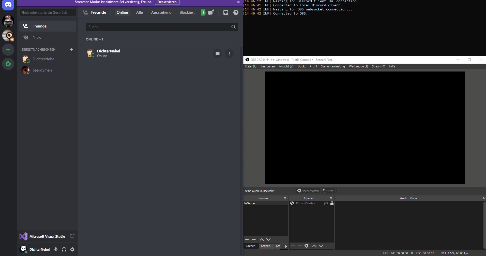
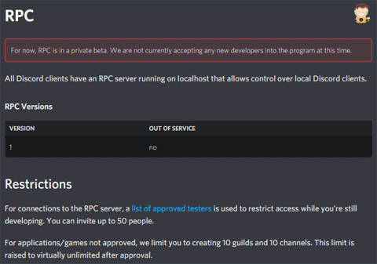

# Voice Channel Grabber [](https://github.com/dichternebel/voice-channel-grabber/blob/main/LICENSE)
Sync your StreamKit Browser Source in OBS with your current voice channel from your Discord client.

**tl;dr**  
If you are a streamer using OBS and Discord StreamKit Overlay you will want this thing for synchronizing your OBS Browser Source automagically.
To get it, just [join my Discord](#joining-the-public-beta) and ask for it!

## Demo
See it in action here:



## The Story behind
Are you also using **OBS** for streaming? And do you use **Discord**? Then you probably also use the **StreamKit Discord Overlay** Browser Source in OBS. So do I!

That's a great combination to let your viewers know, who is on the server with you, who is currently talking and so on.

But for me this was also a combination that often failed. And the simple reason for that is the fact, that you have to tell StreamKit what Discord Server and what Voice Channel you are currently on.

When adding the Browser Source in OBS the StreamKit URL looks something like this:

```javascript
https://streamkit.discord.com/overlay/voice/1234567890/0987654321?icon=true&online=true&logo=white...
```

The first number is the `Guild/Server-ID` and the second is the `Voice Channel-ID`.

So, if you stick on one server and one voice channel that's perfectly working.

**But what if you play on different servers or change channels during your stream?**

Then you either have to edit the server and channel IDs in the `OBS Browser Source URL field` each time you switch, or like what I did have multiple Browser Sources with the different Server-IDs and Channel-IDs I used play on.  
But hell, sometimes I forgot to enable/show the sources, disable/hide other sources or I forgot completely about it... resulting in either displaying the wrong, or even multiple channels or nothing at all during the stream. :-/

**I do not want to take care about this overlay: It should just work!!!**

So the idea was to be able to synchronize the `Discord StreamKit URL` with the currently selected Discord Voice channel. This line of code with two variables is what I started with:

```javascript
https://streamkit.discord.com/overlay/voice/{guildId}/{channelId}?icon=true&online=true&logo=white
```

And long story short: the final result is this git repository. :-D

## Ok, sick! What do I need to get this thing?

Well, unfortunately Discord is still limiting the usage of the underlying technology called `"RPC"` or `"IPC"`:


> source: https://discord.com/developers/docs/topics/rpc

So there are currently only two possibilities:
1. Ask to join the public Beta I'm starting right now or
2. build and run this thing on your own

### Joining the public Beta

I am able to offer up to 50 seats to people wanting to test-drive this thing. This should be more than enough for my range of influence that is 4.42 on average! KEKW!

So just [join my discord](https://discord.gg/4WFudUV6sm) and ask me, I will add you to the list of testers.

But please only ask for joining this public Beta if you really want to use this for streaming! Also please fulfill all prerequisites prior joining:

- You are using `OBS on Windows`
- You are using the `Discord Client for Windows` (not the Browser-App!)
- You have already installed the [obs-websocket extension](https://github.com/obsproject/obs-websocket/) for OBS
- You have [StreamKit Discord Overlay](https://streamkit.discord.com/overlay) authorized in Discord and already successfully used it with a `Browser Source in OBS`
- You have an idea why this could be useful for streamers
- Most important: You are no asshole!

You will get a download link for the console application that synchronizes Discord with OBS. Please keep in mind, that this thing must run as long as you use OBS!

### Building this
It's developed with Visual Studio 2019, but should also be compilable in VS Code.

After building the code all you have to do is go to the [discord developer portal](https://discord.com/developers/applications) and add a `private application`. This thing is not working for apps associated to a team due to the RPC limitations mentioned above resulting in OAuth2 scope errors.

Rename the `app.config.example` to `app.config` and paste your client id and client secret into the settings. If you prefer like me a single file application, hit the publish functionality in Visual Studio. That should be it!


